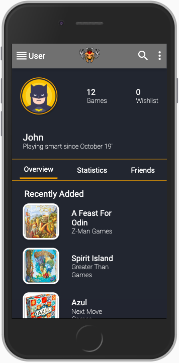

This project was bootstrapped with [Create React App](https://github.com/facebook/create-react-app).

# boardhero

A mobile first application to keep track of your boardgames. Create your own account with a digital portfolio of all the games you own and add the ones you want to your Wishlist.

# Showcase





# Hosting

The Website is currently hosted via heroku.

[Boardhero](https://board-hero.herokuapp.com/)

## Usage

Install client and server dependencies:

```
npm install
cd client
npm install
```

To start the server and client at the same time:

```
npm run dev
```
